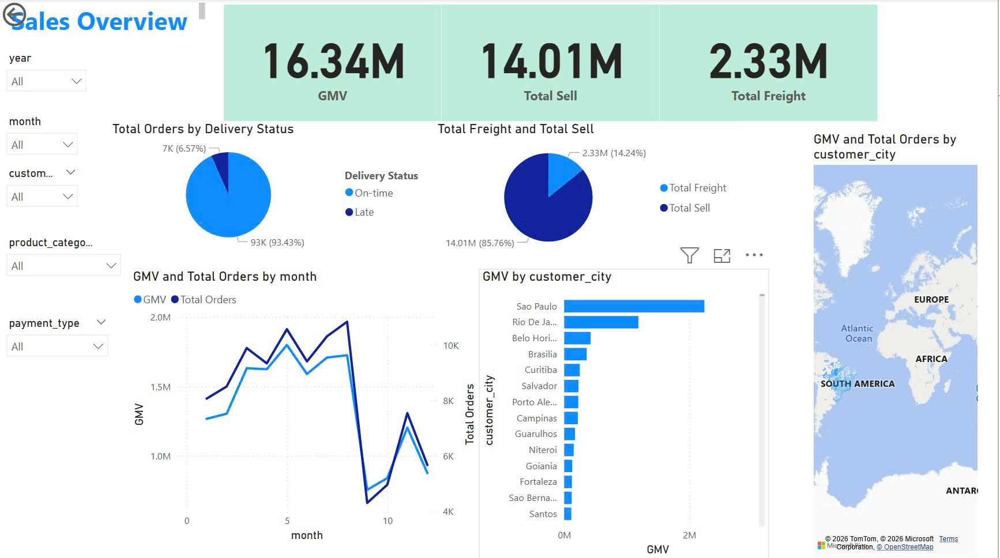
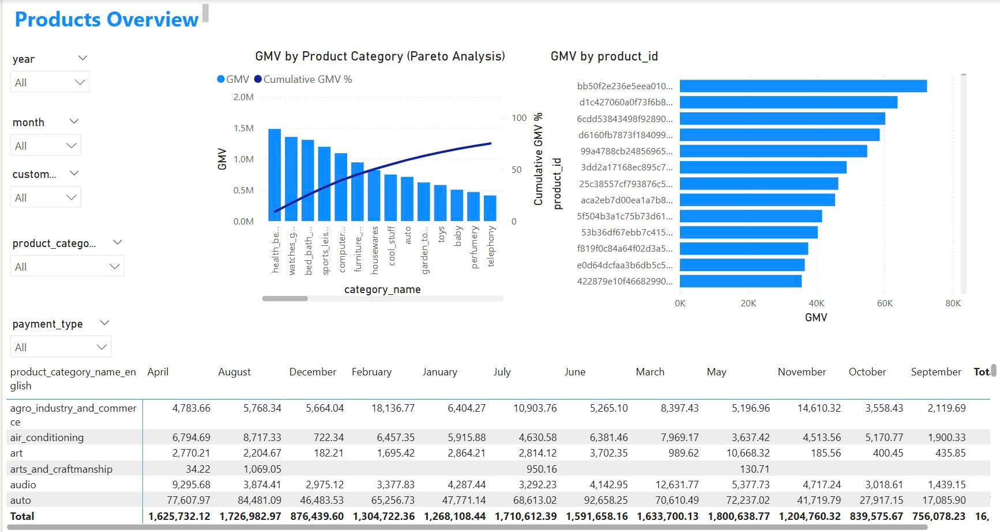

# Olist Analytics Platform

End-to-end Data Engineering + BI project for Olist e-commerce data (Brazil, ~100K orders).

Built with an **ELT architecture**: Apache Airflow extracts raw data from MySQL into PostgreSQL, then **dbt** transforms it into a Star Schema data warehouse using a 3-layer model (staging → intermediate → marts).

## Architecture

```
MySQL (Source)                PostgreSQL                      Metabase
  9 raw tables    ──────>    schema: staging    ──────>      Dashboard
                  Airflow         │              dbt
                  Extract         ▼              Transform
                             schema: staging_dbt
                             (views — clean data)
                                  │
                                  ▼
                             schema: warehouse
                             (tables — dim & fact)
```

### Airflow DAG: `e_commerce_elt`

```
drop_dbt_staging_views → extract_and_load_to_staging → dbt_deps → dbt_run → dbt_test
```

## Tech Stack

| Component | Technology | Role |
|---|---|---|
| Source DB | MySQL 8.0 | Operational data (Olist dataset) |
| Data Warehouse | PostgreSQL 14 | Staging + warehouse schemas |
| Orchestrator | Apache Airflow 2.9.2 | Schedule & trigger pipeline |
| Transform | dbt-core 1.8.7 | SQL-based transform on PostgreSQL |
| BI Dashboard | Metabase | Data visualization |
| Infrastructure | Docker Compose | 7 containerized services |

## Data Warehouse — Star Schema

```
                    ┌──────────────┐
                    │  dim_date    │
                    └──────┬───────┘
┌──────────────┐           │           ┌──────────────┐
│dim_customers │───┐       │       ┌───│ dim_sellers   │
└──────────────┘   │       │       │   └──────────────┘
                   ▼       ▼       ▼
┌──────────────┐  ┌────────────────┐  ┌──────────────┐
│dim_geolocation│→│  fact_orders   │←│ dim_products  │
└──────────────┘  └────────────────┘  └──────────────┘
                         ▲
                   ┌─────┘
                   │
              ┌────────────┐
              │dim_payments│
              └────────────┘
```

### dbt 3-Layer Model

| Layer | Schema | Materialization | Models | Purpose |
|---|---|---|---|---|
| **Staging** | `staging_dbt` | VIEW | 8 | Clean, cast types, normalize strings |
| **Intermediate** | *(CTE only)* | EPHEMERAL | 2 | Join tables, compute delivery metrics |
| **Marts** | `warehouse` | TABLE | 7 | Final dim & fact with surrogate keys |

## Repository Structure

```
├── dags/
│   ├── extract_data.py                   # Extract: MySQL → PostgreSQL staging
│   └── transform/
│       └── e_commerce_dw_dag.py          # DAG: drop → extract → deps → run → test
│
├── dbt_olist/                            # dbt project
│   ├── dbt_project.yml                   # 3-layer materialization config
│   ├── packages.yml                      # dbt_utils
│   ├── profiles/profiles.yml             # PostgreSQL connection
│   ├── macros/
│   │   ├── generate_schema_name.sql      # Override schema naming
│   │   └── drop_staging_views.sql        # Pre-extract cleanup
│   └── models/
│       ├── staging/                      # 8 views (clean raw data)
│       ├── intermediate/                 # 2 ephemeral models (join & enrich)
│       └── marts/                        # 7 tables (dim & fact)
│
├── plugins/                              # Custom Airflow operators
├── data/raw/                             # Source CSV files
├── docs/                                 # Project documentation
├── docker-compose.yaml
├── Dockerfile
└── requirements.txt
```

## Quick Start

### Prerequisites
- Docker & Docker Compose
- Free ports: 3000, 3307, 5433, 8080

### 1. Start all services

```bash
docker compose build
docker compose up -d
```

### 2. Load CSV data into MySQL (first time only)

```bash
make mysql_create
make mysql_load
```

### 3. Configure Airflow connections (first time only)

Open http://localhost:8080 (login: `airflow` / `airflow`)

Create connections in **Admin → Connections**:

| Conn ID | Type | Host | Schema | Login | Password | Port |
|---|---|---|---|---|---|---|
| `mysql` | MySQL | mysql | olist | admin | admin | 3306 |
| `postgres` | Postgres | de_psql | postgres | admin | admin | 5432 |

### 4. Run the pipeline

**Via Airflow UI:**
- Find DAG `e_commerce_elt` → Unpause → Trigger

**Via CLI:**
```bash
docker exec olist_analytics_platform-airflow-webserver-1 \
  airflow dags trigger e_commerce_elt
```

### 5. View dashboard

- **Metabase**: http://localhost:3000
- **PostgreSQL**: `localhost:5433` (schema: `warehouse`)

## KPIs Tracked

- GMV (Gross Merchandise Value)
- Total Orders & AOV (Average Order Value)
- Cancel Rate
- Delivery Performance (on-time vs late)
- Top categories / cities / states by revenue

## Dashboard Preview

### Sales Overview



### Products Overview



## Documentation

| Document | Description |
|---|---|
| [Project Overview](docs/project_overview.md) | Architecture, schemas, DAG details |
| [Migration Guide (ETL → ELT)](docs/migration_etl_to_elt_dbt.md) | Step-by-step migration, troubleshooting, advanced roadmap |