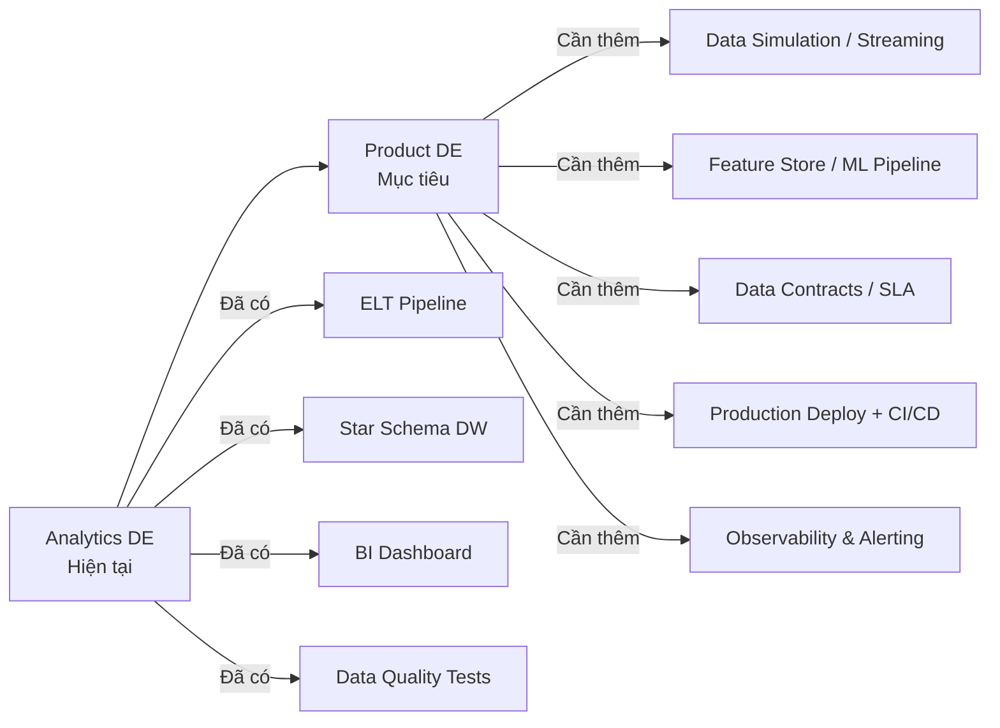
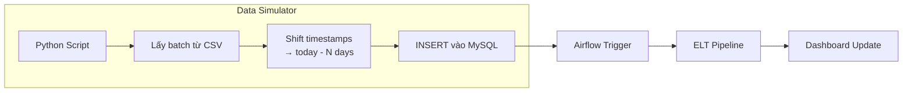
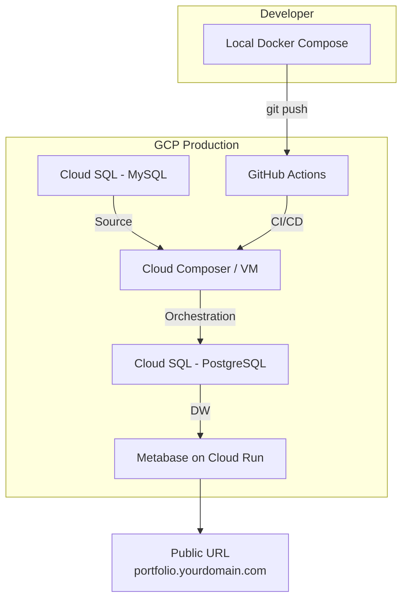

# 🚀 Olist Analytics Platform — Product DE Roadmap

## Mục lục
1. [Product Data Engineer là gì?](#1-product-data-engineer-là-gì)
2. [Đánh giá hiện trạng Project](#2-đánh-giá-hiện-trạng-project)
3. [Pillar 1: Data Simulation — Giả lập dữ liệu real-time](#3-pillar-1-data-simulation)
4. [Pillar 2: Production Deployment](#4-pillar-2-production-deployment)
5. [Pillar 3: Product DE Features](#5-pillar-3-product-de-features)
6. [Prioritized Timeline](#6-prioritized-timeline)
7. [Recruiter-Ready Checklist](#7-recruiter-ready-checklist)

---

## 1. Product Data Engineer là gì?

### So sánh các hướng Data Engineer

| Dimension | **Platform DE** | **Product DE** | **Analytics DE** |
|---|---|---|---|
| **Focus** | Infra, pipelines, reliability | Data phục vụ **product features** | Data phục vụ BI/reporting |
| **Stakeholder** | SRE, DevOps | Product Manager, Backend dev | Business Analyst, C-level |
| **Output** | Stable infra, low latency | Feature tables, ML pipelines, A/B test data | Dashboards, reports |
| **Metrics quan tâm** | Pipeline uptime, data freshness | Feature adoption, conversion impact | GMV, revenue, KPIs |
| **Ví dụ công việc** | Build Kafka cluster, optimize Spark | Build user recommendation features, churn prediction pipeline | Build dbt models cho finance team |

### Product DE — Đặc trưng

> **Product DE = Data Engineer + Product Thinking**

Một Product DE không chỉ xây pipeline mà còn:

1. **Hiểu business impact** — Dữ liệu này ảnh hưởng đến feature nào? User nào?
2. **Build data products** — Feature stores, scoring pipelines, real-time alerts
3. **Measure & iterate** — A/B test data, experimentation platform
4. **Self-serve analytics** — Empower teams tự query mà không cần DE hỗ trợ

### Áp dụng vào Olist Project

Hiện tại project của bạn thiên về **Analytics DE** (pipeline → warehouse → dashboard). Để chuyển sang **Product DE**, cần thêm:



---

## 2. Đánh giá hiện trạng Project

### ✅ Đã có (tốt)
- ELT pipeline: MySQL → PostgreSQL (Airflow + dbt)
- Star Schema: 6 dims + 1 fact
- dbt 3-layer (staging → intermediate → marts)
- Data quality tests (singular + generic)
- Email alerts (fail + success)
- Docker Compose (7 services)
- Metabase dashboard

### ⚠️ Thiếu (cần cải thiện)
| Gap | Tại sao quan trọng |
|---|---|
| Dữ liệu tĩnh (2016-2018) | Dashboard không có time-series trend, không thể demo "live" |
| Chưa deploy production | Recruiter không thể xem online, chỉ chạy local |
| Không có CI/CD | Không professional, không test tự động khi push code |
| Không có data contracts | Không có SLA, freshness monitoring |
| Không có incremental models | dbt chạy full-refresh mỗi lần |
| Chưa có CDC/streaming | Mọi thứ là batch, không có near-real-time |
| Không có lineage visualization | Recruiter không thấy được data flow |

---

## 3. Pillar 1: Data Simulation

### Mục tiêu
Giả lập dữ liệu mới được "bơm" vào MySQL theo thời gian → Dashboard có trend tăng/giảm theo ngày, giống production thực tế.

### Approach: Time-shifting + Incremental Injection



### Thiết kế chi tiết

#### 3.1. Script giả lập: `dags/simulate_new_orders.py`

```python
"""
Giả lập dữ liệu e-commerce mới bằng cách:
1. Random sample N orders từ historical data
2. Shift tất cả timestamps về ngày hiện tại
3. Thay đổi nhẹ price/freight (±10%) để tạo variance
4. INSERT vào MySQL (append, không replace)
"""

import random
import pandas as pd
from datetime import datetime, timedelta
from mysql_operator import MySQLOperator

ORDERS_PER_DAY = 150  # ~tương đương Olist thực tế

def simulate_daily_orders(**kwargs):
    execution_date = kwargs['execution_date']
    mysql = MySQLOperator("mysql")
    
    # 1. Sample random orders từ historical data
    df_orders = mysql.get_data_to_pd(
        f"SELECT * FROM orders ORDER BY RAND() LIMIT {ORDERS_PER_DAY}"
    )
    
    # 2. Shift timestamps
    today = execution_date.date()
    time_shift = today - df_orders['order_purchase_timestamp'].dt.date.min()
    
    for col in ['order_purchase_timestamp', 'order_approved_at',
                'order_delivered_carrier_date', 'order_delivered_customer_date',
                'order_estimated_delivery_date']:
        if col in df_orders.columns:
            df_orders[col] = pd.to_datetime(df_orders[col]) + time_shift
    
    # 3. Generate new order_ids (avoid duplicates)
    df_orders['order_id'] = [
        f"sim_{today.strftime('%Y%m%d')}_{i:04d}" 
        for i in range(len(df_orders))
    ]
    
    # 4. Vary prices ±10%
    # ... (similar for order_items, payments)
    
    # 5. Insert to MySQL
    mysql.insert_dataframe(df_orders, 'orders', if_exists='append')
```

#### 3.2. dbt Incremental Model (thay vì full-refresh)

Chuyển `fact_orders` sang **incremental**:

```sql
-- models/marts/fact_orders.sql
{{ config(
    materialized='incremental',
    unique_key='order_id',
    incremental_strategy='merge'
) }}

...


where eo.order_purchase_timestamp > (
    select max(order_date_key) from {{ this }}
) - interval '3 days'

```

#### 3.3. DAG mới: `simulate_and_refresh`

```
simulate_daily_orders → extract_new_data → dbt_run_incremental → dbt_test → email_success
```

Chạy **daily** — mỗi ngày bơm 100-200 orders mới.

---

## 4. Pillar 2: Production Deployment

### Option A: GCP (Recommended — Free tier friendly)



| Component | GCP Service | Chi phí ước tính |
|---|---|---|
| MySQL (source) | Cloud SQL micro | ~$7/month (hoặc dùng VM) |
| PostgreSQL (DW) | Cloud SQL micro | ~$7/month |
| Airflow | Compute Engine e2-small | ~$13/month |
| Metabase | Cloud Run (serverless) | ~$0-5/month |
| **Total** | | **~$25-30/month** |

### Option B: Render/Railway (Simpler, cheaper)

| Component | Service | Chi phí |
|---|---|---|
| PostgreSQL | Render free tier | $0 |
| Metabase | Railway | ~$5/month |
| Airflow | Render background worker | ~$7/month |

### Option C: VPS (Cheapest for full control)

| Component | Service | Chi phí |
|---|---|---|
| Everything | Hetzner/DigitalOcean VPS 4GB | **~$6/month** |
| Domain | Namecheap | ~$10/year |

> [!TIP]
> **Recommended cho recruiter demo**: Option C (VPS) — rẻ nhất, chạy y hệt Docker Compose hiện tại, chỉ cần `docker compose up -d` trên VPS.

### CI/CD với GitHub Actions

```yaml
# .github/workflows/ci.yml
name: CI/CD Pipeline
on:
  push:
    branches: [main]

jobs:
  dbt-test:
    runs-on: ubuntu-latest
    services:
      postgres:
        image: postgres:14
        env:
          POSTGRES_USER: test
          POSTGRES_PASSWORD: test
        ports: ['5432:5432']
    steps:
      - uses: actions/checkout@v4
      - uses: actions/setup-python@v5
        with:
          python-version: '3.10'
      - run: pip install dbt-core dbt-postgres
      - run: dbt deps --project-dir dbt_olist
      - run: dbt build --project-dir dbt_olist --target ci
  
  deploy:
    needs: dbt-test
    runs-on: ubuntu-latest
    steps:
      - uses: actions/checkout@v4
      - name: Deploy to VPS
        uses: appleboy/ssh-action@v1
        with:
          host: ${{ secrets.VPS_HOST }}
          username: ${{ secrets.VPS_USER }}
          key: ${{ secrets.VPS_KEY }}
          script: |
            cd ~/olist-analytics
            git pull origin main
            docker compose up -d --build
```

---

## 5. Pillar 3: Product DE Features

### 5.1. dbt Snapshots — Slowly Changing Dimensions (SCD Type 2)

Track sự thay đổi của sellers/products theo thời gian:

```sql
-- snapshots/snap_sellers.sql

{{
    config(
        target_schema='snapshots',
        unique_key='seller_id',
        strategy='check',
        check_cols=['seller_city', 'seller_state'],
    )
}}
select * from {{ source('staging', 'stg_sellers') }}

```

> [!IMPORTANT]
> SCD Type 2 là skill **rất được recruiters đánh giá cao** — nó cho thấy bạn hiểu data modeling beyond basic star schema.

### 5.2. dbt Exposures — Data Catalog + Lineage

```yaml
# models/marts/schema.yml — thêm exposures
exposures:
  - name: sales_overview_dashboard
    type: dashboard
    maturity: high
    url: http://localhost:3000/dashboard/1
    description: "Main sales KPI dashboard for business team"
    depends_on:
      - ref('fact_orders')
      - ref('dim_customers')
      - ref('dim_products')
    owner:
      name: Thien Pham
      email: burizamon@gmail.com
```

### 5.3. Data Freshness & SLA Monitoring

```yaml
# models/staging/schema.yml — thêm freshness
sources:
  - name: staging
    freshness:
      warn_after: {count: 24, period: hour}
      error_after: {count: 48, period: hour}
    loaded_at_field: _etl_loaded_at  # cần thêm column này khi extract
    tables:
      - name: stg_orders
      - name: stg_order_items
```

### 5.4. dbt Metrics Layer (Semantic Layer)

```yaml
# models/marts/metrics.yml
metrics:
  - name: gmv
    label: "Gross Merchandise Value"
    type: sum
    sql: total_amount
    timestamp: order_date_key
    time_grains: [day, week, month, quarter]
    model: ref('fact_orders')
    
  - name: aov
    label: "Average Order Value"
    type: average
    sql: total_amount
    timestamp: order_date_key
    time_grains: [day, week, month]
    model: ref('fact_orders')
```

### 5.5. Great Expectations / Elementary (Advanced Observability)

```yaml
# packages.yml — thêm
packages:
  - package: dbt-labs/dbt_utils
    version: "1.3.0"
  - package: elementary-data/elementary
    version: "0.16.1"
```

Elementary cung cấp:
- **Anomaly detection** tự động (volume, freshness, schema changes)
- **Dashboard observability** built-in
- **Test results history** theo thời gian

---

## 6. Prioritized Timeline

### Phase 1: Quick Wins (1-2 tuần) — 🟢 Làm ngay

| # | Task | Impact | Effort |
|---|---|---|---|
| 1 | **Data Simulator script** | Dashboard sống động | 1-2 ngày |
| 2 | **Incremental dbt models** | Professional pipeline | 1 ngày |
| 3 | **dbt Exposures + docs** | Lineage graph đẹp | 0.5 ngày |
| 4 | **dbt Snapshots** (SCD2) | Resume skill point | 1 ngày |
| 5 | **Source freshness** | Data SLA monitoring | 0.5 ngày |

### Phase 2: Production Ready (2-3 tuần) — 🟡 Ưu tiên cao

| # | Task | Impact | Effort |
|---|---|---|---|
| 6 | **Deploy lên VPS** + domain | Recruiter xem online | 1-2 ngày |
| 7 | **GitHub Actions CI/CD** | Professional workflow | 1 ngày |
| 8 | **README + Architecture diagram** nâng cấp | First impression | 1 ngày |
| 9 | **Elementary observability** | Data quality dashboard | 1-2 ngày |
| 10 | **dbt Metrics layer** | Semantic layer demo | 1 ngày |

### Phase 3: Differentiators (optional, 3-4 tuần) — 🔵 Nếu có thời gian

| # | Task | Impact | Effort |
|---|---|---|---|
| 11 | **Streaming layer** (Kafka + Debezium CDC) | Near real-time | 1 tuần |
| 12 | **Feature Store** (churn prediction features) | ML Engineering skill | 1 tuần |
| 13 | **Terraform IaC** | Cloud engineering skill | 3-5 ngày |
| 14 | **Apache Superset** thay Metabase | Open-source showcase | 2-3 ngày |

---

## 7. Recruiter-Ready Checklist

### README phải có

- [ ] **Architecture diagram** (Mermaid hoặc draw.io) — đẹp, rõ ràng
- [ ] **Live demo link** — `https://olist.yourdomain.com`
- [ ] **Tech stack badges** — shields.io
- [ ] **Screenshots/GIF** của dashboard đang chạy
- [ ] **Data flow animation** — từ source → warehouse → dashboard
- [ ] **Key decisions** — Tại sao chọn ELT? Tại sao Star Schema? Tại sao dbt?

### Repo phải có

- [ ] **CI/CD green badge** trên GitHub
- [ ] **Clean git history** — meaningful commits
- [ ] **Branch protection** — main branch protected
- [ ] **Issue tracking** — GitHub Issues cho roadmap
- [ ] **Documentation** — dbt docs, project docs
- [ ] **No secrets exposed** — .env trong .gitignore

### Interview talking points

Khi recruiter hỏi về project, bạn nên highlight:

1. **"Tôi thiết kế pipeline xử lý incremental data, không chỉ full-refresh"** → dbt incremental
2. **"Tôi implement SCD Type 2 để track historical changes"** → dbt snapshots
3. **"Pipeline có data quality tests tự động và email alerts"** → dbt test + EmailOperator
4. **"Tôi có CI/CD — code changes được test tự động trước khi deploy"** → GitHub Actions
5. **"Tôi hiểu data freshness SLA và có monitoring"** → source freshness + Elementary
6. **"Tôi giả lập production workload để test pipeline ở scale"** → Data Simulator

> [!IMPORTANT]
> **Product DE differentiator**: Khi trình bày, luôn nói **"dữ liệu này phục vụ business decision gì?"** thay vì chỉ mô tả technical. Ví dụ: "fact_orders giúp PM track conversion rate theo category, từ đó quyết định promotion strategy" — đây là tư duy Product DE.

---

## Next Steps

Bạn muốn bắt đầu từ đâu? Tôi suggest:

1. **🟢 Data Simulator** → Làm dashboard sống động ngay
2. **🟢 dbt Incremental + Snapshots** → Upgrade pipeline
3. **🟡 Deploy VPS + CI/CD** → Recruiter có thể xem online

Cho tôi biết bạn muốn bắt đầu với phần nào, tôi sẽ code ngay!
